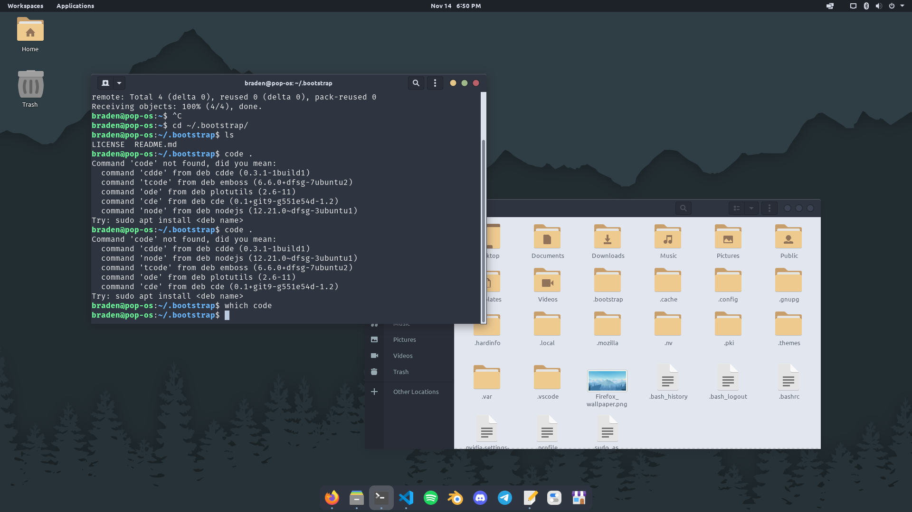

# Bootstrap Pop!

A quick post-install script for Pop! OS to get it ready for most coding and visual effects tasks



## Getting Started

Clone the repository and run the install command

```bash
git clone https://github.com/Braden-Preston/bootstrap-pop.git ~/.bootstrap
~/.bootstrap/install.sh
```

## Removal

Will only reset themes and preferences back to default. Will not remove applications or their preferences.

```bash
~/.bootstrap/remove.sh
```

## What's Inside

- Adjustments to Cosmic Desktop
- Installation of Gnome Tweaks
- Papirus Icons w/ BlueGrey folders
- Nordic Polar/Darker GTK Themes
- MacOS-like task runner with ArcMenu

Utilities

- htop, openrgb, gparted

Apps
- VSCode, Blender, Spotify, Discord, Telegram, Gimp, Inkscape